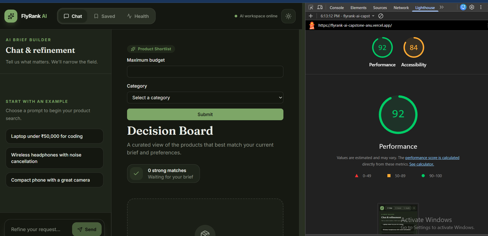
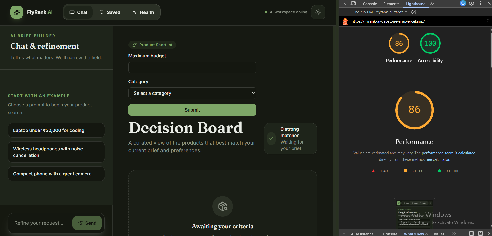

# Accessibility & Performance Audit

## Overview

This audit documents the Lighthouse and WAVE accessibility review performed on the deployed FlyRank AI application.

The primary goals were to improve mobile accessibility, verify keyboard navigation, and address accessibility issues identified by automated audits.

---

## 1. Lighthouse Baseline

The initial Lighthouse mobile audit produced:

| Metric        | Before |
| ------------- | -----: |
| Performance   |     92 |
| Accessibility |     84 |

The initial Accessibility score identified issues related to accessible names, color contrast, and heading structure.

---

## 2. WAVE Baseline

The initial WAVE audit produced:

| Check           | Before |
| --------------- | -----: |
| Errors          |      0 |
| Contrast Errors |      0 |
| Alerts          |      2 |

The two initial alerts were:

1. Skipped heading level
2. Redundant link

---

## 3. Accessibility Improvements

### Heading hierarchy

The empty-state heading `Awaiting your criteria` was changed from an `h3` to an `h2`.

This fixed the heading-level skip because the page's main heading is an `h1`.

### Accessible button name

The Send button uses an icon that remains visible when the text label is hidden on mobile.

An accessible name was added:

```tsx
aria-label="Send message"
```

This allows screen readers to identify the button even when the visible `Send` text is hidden.

### Accessible logo link

The FlyRank AI logo link can display only the icon on smaller screens.

An accessible name was added:

```tsx
aria-label="FlyRank AI home"
```

### Navigation contrast

Inactive navigation items originally used `text-muted-foreground`.

They were changed to `text-foreground` to provide stronger text and icon contrast.

### Keyboard navigation

The primary user flow was tested using keyboard navigation.

The following were verified:

* Navigation links can be reached with `Tab`.
* Chat input can be reached with `Tab`.
* Chat controls are keyboard reachable.
* The AI generation Stop button can be reached and activated using the keyboard.

### AI streamed output

The assistant's streamed response uses an appropriate live/status announcement mechanism so that dynamically generated content can be communicated to assistive technologies without unnecessarily interrupting the user.

---

## 4. Final Lighthouse Results

After the accessibility fixes, the Lighthouse mobile audit produced:

| Metric        | Before |   After |
| ------------- | -----: | ------: |
| Performance   |     92 |      88 |
| Accessibility |     84 | **100** |

Accessibility improved by **16 points**, reaching the target score of 100.

Performance changed from 92 to 88 between audit runs. This was not treated as an accessibility improvement, since Lighthouse performance scores can vary between runs and environments.

### Lighthouse screenshots

**Before:**



**After:**



---

## 5. Final WAVE Results

The final WAVE audit produced:

| Check           | After |
| --------------- | ----: |
| Errors          | **0** |
| Contrast Errors | **0** |
| Alerts          |     1 |

The remaining alert is an intentional redundant-link warning.

### Intentional redundant link

The navbar contains both:

* The FlyRank AI logo linking to `/`
* The Chat navigation item linking to `/`

These links serve different navigation purposes. The logo provides conventional home navigation, while the Chat item explicitly identifies the application's primary chat destination.

Therefore, the WAVE alert was reviewed and intentionally retained rather than removing useful navigation.

---

## 6. Final Verification

The final audit confirms:

* Lighthouse Accessibility: **100**
* WAVE Errors: **0**
* WAVE Contrast Errors: **0**
* Primary flow tested with keyboard navigation
* AI Stop button verified as keyboard reachable
* Accessibility labels added where required
* Heading hierarchy corrected
* Navigation contrast improved
* Remaining WAVE alert reviewed and justified

## Conclusion

The FlyRank AI application was reviewed using Lighthouse and WAVE with a focus on mobile accessibility and the primary AI chat flow.

The Accessibility score improved from **84 to 100**, while WAVE reported **0 errors and 0 contrast errors** after the fixes.
