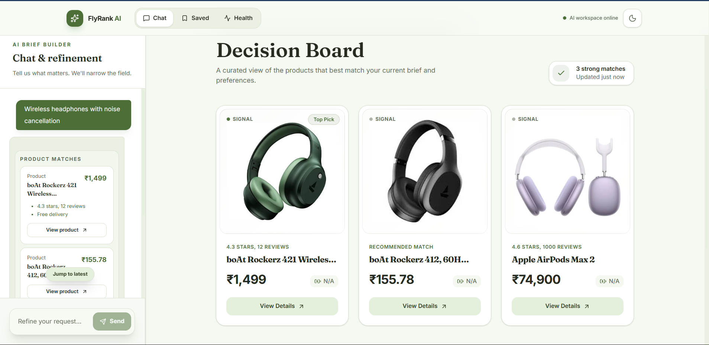
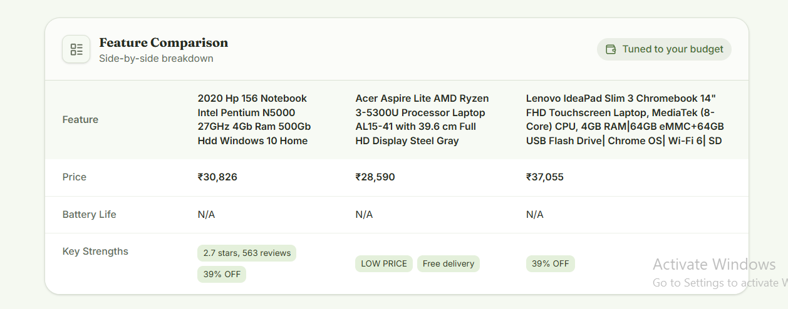
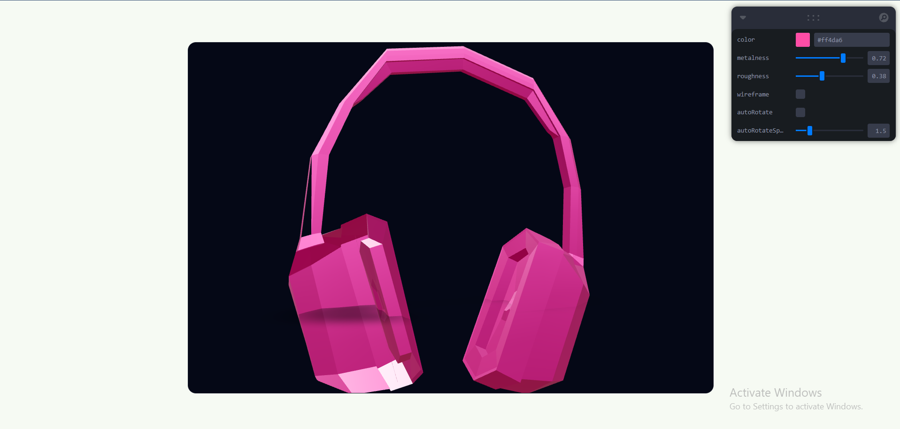
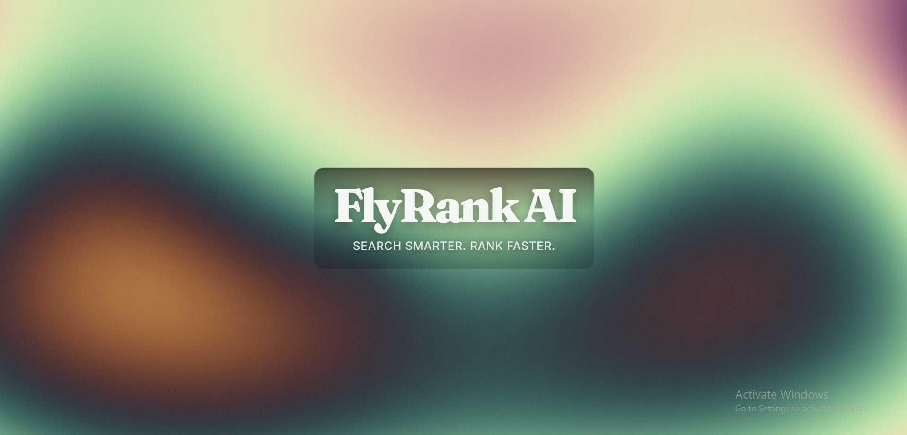

# FlyRank AI Front-end AI Engineering Capstone

An AI shopping agent built as part of the FlyRank AI Front-end AI Engineering track. Users describe what they're shopping for in natural language, and the assistant searches real product listings, compares them, and explains its recommendations — powered by an LLM with tool-calling, not a static search form.

**Live app:** https://flyrank-ai-capstone-anu.vercel.app/

## Project Brief

FlyRank AI is a conversational shopping assistant that helps people decide what to buy instead of just searching for it. A user describes their needs in plain language ("wireless headphones under ₹10,000 for travel, noise cancellation matters"), and the assistant asks clarifying questions, searches real product listings via Google Shopping, and explains _why_ each recommendation fits — rendering results as comparable cards and a side-by-side table, not a wall of text. It's built for anyone who finds product research overwhelming: too many tabs, too many specs, no clear "which one for me." I chose this idea because it's a genuine test of agentic AI patterns — tool-calling, structured output, real external data — rather than a chatbot wrapper that just echoes text back.

## Screenshots






## Features

- **Streaming AI chat** — real-time token-by-token responses via the AI SDK and Google Gemini, with a working stop button and multi-turn memory
- **Real product search** — a `searchProducts` tool backed by SerpApi's Google Shopping engine (India-targeted), returning real prices, links, and images — never invented data
- **Decision board** — product cards and a side-by-side comparison table, both driven live by the assistant's actual search results
- **Interactive shader hero** — a fragment-shader hero at `app/shader-hero` using `u_time`, `u_resolution`, and `u_mouse` uniforms, with capped device pixel ratio, tab-hidden pausing, and a static gradient fallback for `prefers-reduced-motion`
- **Accessible components built from scratch** — a hand-built Modal, Tabs, and Disclosure implementing the W3C ARIA Authoring Practices, compared against shadcn/ui in `app/playground/NOTES.md`
- **Resilient error handling** — a root `error.tsx` boundary, a chat-level retry banner for failed messages, layout-matched loading skeletons, and designed empty states with clickable example prompts
- **Motion Button demo** — a fully choreographed Send button (idle → loading → success/error → idle) with reduced-motion support
- **3D product viewer** — an interactive React Three Fiber scene with a live material/color configurator
- **Tested and CI-enforced** — Vitest + React Testing Library component tests, one Playwright end-to-end test (with the AI route mocked, never hitting the real API), and a GitHub Actions workflow that blocks merges on failure
- **Production-hardened AI route** — rate limiting, input caps, and a bounded max duration on the streaming handler (see Production Hygiene below)
- **Audited for accessibility** — Lighthouse mobile accessibility score of 100, zero WAVE errors (see Performance & Accessibility Audit below)

## Tech Stack

- Next.js, React, TypeScript, Tailwind CSS
- AI SDK + Google Gemini for streaming chat and tool calling
- SerpApi (Google Shopping) for real product data
- Upstash Redis for rate limiting
- shadcn/ui, React Three Fiber + drei + leva
- Vitest, React Testing Library, Playwright
- Vercel for deployment

## Getting Started

```bash
npm install
```

Create `.env.local` with the variables below, then:

```bash
npm run dev
```

Visit `http://localhost:3000`.

### Environment Variables

| Variable                       | Required                      | Where to get it                                                                                                                  |
| ------------------------------ | ----------------------------- | -------------------------------------------------------------------------------------------------------------------------------- |
| `GOOGLE_GENERATIVE_AI_API_KEY` | Yes                           | [Google AI Studio](https://aistudio.google.com/app/apikey) — free tier                                                           |
| `SERPAPI_API_KEY`              | Yes (unless `MOCK_MODE=true`) | [SerpApi](https://serpapi.com) — free tier, ~250 searches/month                                                                  |
| `UPSTASH_REDIS_REST_URL`       | Yes                           | [Upstash](https://upstash.com) — create a free Redis database                                                                    |
| `UPSTASH_REDIS_REST_TOKEN`     | Yes                           | Same Upstash database, REST token                                                                                                |
| `MOCK_MODE`                    | No (defaults to `false`)      | Set to `true` to use built-in mock product data instead of calling SerpApi, useful for UI development without spending API quota |

### Running tests

```bash
npm run test          # Vitest component tests
npx playwright test   # end-to-end test
```

## Project Structure

```text
flyrank-ai-capstone/
│
├── app/
│   ├── (shop)/
│   │   ├── ...                 # Main shopping/product routes
│   │   └── ...
│   │
│   ├── api/
│   │   └── chat/
│   │       └── route.ts        # Streaming AI chat + tool calling, rate-limited
│   │
│   ├── 3d-viewer/               # Interactive 3D product viewer
│   ├── demo/                    # Motion button state-machine demo
│   ├── shader-hero/             # Interactive fragment-shader hero
│   ├── playground/              # Accessible components built from scratch (Modal, Tabs, Disclosure) + NOTES.md comparing to shadcn/ui
│   │
│   ├── error.tsx                # Root error boundary
│   └── ...
│
├── components/
│   ├── chat/
│   │   ├── ChatPanel.tsx
│   │   ├── ToolProductCard.tsx
│   │   └── ...
│   │
│   ├── filters/
│   │   └── BudgetFilter.tsx
│   │
│   └── ui/
│       └── ...                 # Reusable UI components
│
├── lib/
│   ├── ai-config.ts            # AI model + system prompt configuration
│   ├── rate-limit.ts           # Upstash sliding-window rate limiter
│   └── tools/
│       └── search-products.ts  # Product search tool
│
├── e2e/
│   └── ...                     # Playwright tests
│
├── public/
│   ├── models/
│   │   └── headphones.glb      # 3D model asset
│   ├── docs/
│   │   ├── lighthouse-before.png
│   │   └── lighthouse-after.png
│   └── screenshots/
│       ├── chat.png
│       ├── comparison.png
│       ├── 3d.png
│       └── shader-hero.png
│
├── .github/
│   └── workflows/
│       └── ...                 # GitHub Actions CI
│
├── AUDIT.md                     # Accessibility & performance audit (before/after)
├── .env.local                  # Local secrets — not committed
├── package.json
└── README.md
```

## Architecture Overview

The chat and the Decision board are two views of the same state, not two separate features. `useChat` lives at the page level (`page.tsx`), and both `ChatPanel` (the conversation) and the Decision board (product cards + comparison table) read from it — the board is derived by scanning `messages` for the most recent completed `searchProducts` tool call and rendering its output directly. This means there's no separate "fetch products for the board" logic to keep in sync; if the chat has real results, the board shows them.

The `searchProducts` tool is a single point of integration between the LLM and real data: it's defined once with a Zod schema, and its `execute` function either calls SerpApi or returns mock data depending on `MOCK_MODE`, with the same output shape either way. Everything downstream (the tool-state UI, `ToolProductCard`, the Decision board) is written against that one shape and doesn't know or care which source produced it.

## Key Decisions

- **SerpApi over Amazon/Flipkart affiliate APIs** — both official affiliate APIs require pre-existing sales volume or social media following to even get approved, which is backwards for a new project with no users yet. SerpApi's Google Shopping engine gives real prices and links from real retailers with just an API key.
- **Google Gemini over OpenRouter** — started on OpenRouter for provider flexibility, but its free tier's daily request cap (50/day on free models) was hit during normal development testing. Gemini's free tier is substantially more generous, and since the app is built entirely on the AI SDK's `streamText`/tool-calling interface, the swap only touched `lib/ai-config.ts` — nothing else in the app needed to change.
- **`MOCK_MODE` toggle** — added after noticing UI/layout iteration was burning real SerpApi quota on every reload. Flipping one env var switches between real and mock data with an identical output shape, so UI work never costs API calls.
- **Decision board reads chat state instead of maintaining its own** — an earlier version had the Decision board as static/hardcoded content unrelated to the chat. Lifting `useChat` to the page level and deriving the board from actual tool output was a deliberate fix to make the UI honest about what the assistant actually found, not a decorative mockup.

## `searchProducts` Tool

The `searchProducts` tool searches real product listings via SerpApi's Google Shopping engine (or a small mock dataset when `MOCK_MODE=true`), filtered by category, budget, and shopper priorities.

### Input Schema

| Field        | Type                  | Description                                                             |
| ------------ | --------------------- | ----------------------------------------------------------------------- |
| `category`   | `string`              | The product category to search for, such as laptops or headphones.      |
| `maxPrice`   | `number` (optional)   | The maximum acceptable price for the product.                           |
| `priorities` | `string[]` (optional) | The product qualities that matter most, such as battery life or budget. |

### Return Shape

```ts
{
  products: Array<{
    id: string;
    name: string;
    price: number;
    image: string;
    batteryLife: string;
    matchReasons: string[];
    link: string; // real product URL, never invented
  }>;
}
```

Budget filtering happens in code against the real `extracted_price` returned by SerpApi, not just via the search query text. Rate-limit (429) responses from SerpApi are surfaced as a distinct error, separate from generic failures. The system prompt explicitly instructs the model not to state or imply technical specs that aren't present in the actual returned data — added after observing the model invent RAM/processor details for real SerpApi results that didn't include them.

## Production Hygiene

The `/api/chat` route is protected against casual abuse with three layers:

1. **Rate limiting** — an Upstash Redis sliding-window limiter (20 requests/hour per IP) rejects excess requests with a 429 before the request ever reaches Gemini or SerpApi.
2. **Input caps** — requests with more than 50 messages, or any single message over 2,000 characters, are rejected with a 400 before processing.
3. **`maxDuration`** — the route is capped at 30 seconds to prevent a stuck request from running indefinitely, with an internal 15-second timeout on the SerpApi call itself so a hung external API fails gracefully well before the hard cutoff.

## Performance & Accessibility Audit

Full before/after detail lives in [`AUDIT.md`](./AUDIT.md). Summary:

| Metric                            | Before |                                   After |
| --------------------------------- | -----: | --------------------------------------: |
| Lighthouse Performance (mobile)   |     92 |                                      88 |
| Lighthouse Accessibility (mobile) |     84 |                                 **100** |
| WAVE Errors                       |      0 |                                   **0** |
| WAVE Contrast Errors              |      0 |                                   **0** |
| WAVE Alerts                       |      2 | 1 (reviewed and intentionally retained) |

**One concrete improvement:** the empty-state heading `Awaiting your criteria` was demoted from `h3` to `h2`, fixing a skipped heading level under the page's `h1` — a WAVE-flagged issue that also directly improves screen reader navigation of the Decision board. Icon-only buttons (Send, logo) that lost their visible text label on mobile were given explicit `aria-label`s, and inactive nav items were changed from `text-muted-foreground` to `text-foreground` for stronger contrast. The primary flow, including the AI generation Stop button, was verified fully keyboard-reachable.

## Shader Hero

An interactive fragment-shader hero located at `app/shader-hero`. The shader uses `u_time`, `u_resolution`, and `u_mouse` uniforms to create a responsive visual effect that warps toward the cursor.

For performance, the shader caps the device pixel ratio and pauses rendering when the browser tab is hidden. When `prefers-reduced-motion` is enabled, it falls back to a static gradient sampling the same palette instead of running the animation.

## 3D Model Viewer

An interactive headphones product viewer built with React Three Fiber, with a live configurator (color, metalness, roughness, wireframe, auto-rotate) via leva.

**Perf note:** 1,557 kB / 2,202 kB transferred and ~60 FPS — measured via Chrome DevTools Network/Performance tabs. The canvas is lazy-loaded via `next/dynamic` (`ssr: false`) so the Three.js bundle is never loaded outside this route, and a single low-poly model was used to avoid needing DRACO/meshopt compression. A static fallback image renders instead of the canvas when `prefers-reduced-motion` is enabled.

**With more time:** drag-and-drop custom GLB upload, multiple product models, and compression tooling for larger assets.

### 3D Model Credit

Headphones 3D model by Ginsta, downloaded from Poly Pizza. Licensed under CC-BY.

## Known Limitations & Future Improvements

**Limitations:** Product data comes from SerpApi's Google Shopping engine rather than direct Amazon/Flipkart integration, since both require affiliate approval gated behind sales volume or social-media following thresholds impractical for a new project. Free-tier API limits (SerpApi, and the LLM provider) mean heavy concurrent usage could hit rate limits despite the app's own rate limiting. The 3D product viewer currently ships with one preloaded model rather than per-product 3D assets. Match scoring is derived from real fields (rating, reviews, price) rather than a deeper recommendation algorithm. Cross-browser testing covers Chrome and Edge (Chromium engine); Firefox and Safari/mobile Safari have not yet been tested.

**With more time:** I'd add a lightweight memory of user preferences across sessions, proper Amazon/Flipkart affiliate integration once eligible, drag-and-drop custom 3D model support, a more sophisticated ranking signal beyond keyword-priority matching, and complete the Firefox/Safari testing pass.

## Browser Testing

| Browser             | Status                                                                                                                                  |
| ------------------- | --------------------------------------------------------------------------------------------------------------------------------------- |
| Chrome (desktop)    | ✅ Full flow verified                                                                                                                   |
| Edge (desktop)      | ✅ Verified (Chromium engine; one regular-profile issue traced to a local browser extension/cache, not reproducible in a clean profile) |
| Firefox (desktop)   | [ ] Not yet tested                                                                                                                      |
| Safari (desktop)    | [ ] Not yet tested                                                                                                                      |
| Mobile Safari (iOS) | [ ] Not yet tested                                                                                                                      |

## Deployment Checklist

**Environment & compatibility**

- [x] Env vars set in Vercel (Gemini key, SerpApi key, Upstash rate-limit credentials) — verified none committed to git history
- [x] `maxDuration` set on the streaming route (30s) with an internal timeout guard on external API calls
- [ ] Full cross-browser pass (Chrome/Edge done; Firefox/Safari pending — see above)

**Resilience & security**

- [x] Rate limiting (Upstash, sliding window) and input-size caps protect the AI route from abuse
- [x] Error boundaries (`error.tsx`), a chat-level retry banner, layout-matched skeletons, and designed empty states cover the failure surface
- [x] No secrets in git history (verified via `git log`)

**Rollback & monitoring**

- **Rollback plan:** Vercel retains every previous deployment; a broken `main` can be reverted instantly via Vercel's "Promote to Production" on the last known-good deployment, or by reverting the offending commit and re-pushing.
- **Monitoring:** Vercel's built-in function logs surface runtime errors — this is how the SerpApi timeout and rate-limit issues were actually caught during this project.
- No dedicated uptime/alerting service is configured; acceptable for a portfolio-scale project, noted as a gap for a real production service.

## How AI Tools Built This

This project was built almost entirely through prompting GitHub Copilot for implementation, with me making the architecture and design decisions, reviewing every generated change, and debugging when things broke. Some specific examples of real problems caught, not just "AI helped me code faster":

- **A schema mismatch that silently broke every message.** `useChat` sends messages in a `UIMessage` format with a `parts` array, but `streamText` expects plain `ModelMessage` objects. The route handler passed raw messages straight through, and Zod validation rejected them with a cryptic error. Fixed by adding `convertToModelMessages()` before the `streamText` call.
- **A build-time 500 caused by a self-referential fetch.** An early version of the `/health` page fetched its own `/api/health` route over HTTP during Next.js's static pre-render step — at that point in the build, the app isn't live yet, so the fetch failed every time. Fixed by computing the health data directly in the Server Component instead of making a network call to itself.
- **Hallucinated specs from real data.** After switching from mock data to real SerpApi results, the model started inventing RAM, processor, and storage details in its text responses that weren't present anywhere in the actual API response. This directly violated the project's own rule to never invent product specifications. Fixed by explicitly instructing the system prompt to only reference fields actually present in the tool's output.
- **A mobile scroll-trapping bug.** The chat panel's `overscroll-contain` combined with a full-viewport height on mobile meant users could get stuck scrolling inside the chat with no way to reach the Decision board below it. Fixed by capping the mobile chat height and removing the overscroll containment.

Where I made the calls: visual/UX direction (several full redesigns — teal → pink → sage — before landing on the current theme), which product data source to integrate and why, when mock data vs. real API calls made sense, and every accessibility and error-handling requirement's actual behavior (each was manually tested, not just assumed correct because the code compiled). Where AI did the heavy lifting: writing the implementation for each of those decisions once specified, and generating first-pass fixes for bugs that I then verified by re-testing, not just re-reading the diff.

## Reflection

The hardest part wasn't any single bug — it was the number of times a fix in one place quietly broke something else: moving `frontend/` to the repo root broke Vercel's build until I updated the Root Directory setting; switching from OpenRouter to Gemini meant re-checking every file that referenced the old provider, including docs I'd already written. The real lesson was that in an AI-assisted workflow, _reviewing_ what the assistant generates matters more than writing code yourself — the most serious bug I shipped wasn't a syntax error, it was the model hallucinating laptop specs (RAM, processor) that didn't exist anywhere in the real SerpApi data I'd fetched. That one only surfaced because I actually read the assistant's response against the raw API data, not because any test caught it.

What surprised me most: a Server Component silently self-fetching its own API route during Vercel's build step (before the app was even live) taught me more about how Next.js actually works than any tutorial had — that class of bug simply doesn't exist in a simpler request/response app.

Next time, I'd write the resilience/error-handling pass earlier, not as a dedicated late-stage assignment — several of the bugs I found while deliberately "sabotaging" my own app (mid-stream failures, rate limits) had clearly been silently possible since the very first version of the chat feature.

## Status

Core AI shopping flow, real product search, error handling, accessibility components, automated testing/CI, production hygiene, and supplementary interaction assignments (the demo motion button, shader hero, 3D viewer) are complete and deployed. See individual assignment notes in `app/playground/` for details on specific builds, and [`AUDIT.md`](./AUDIT.md) for the full accessibility/performance audit.

## License

This project is licensed under the MIT License. See [LICENSE](./LICENSE) for details.
